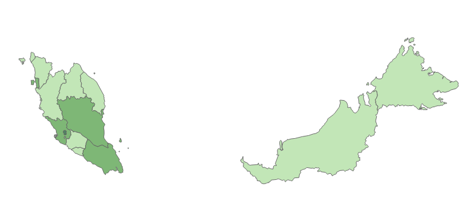

# Predictive Modeling of Sustainable Tourism Practices Using Online Travel Agent (OTA) Platform: A Malaysian Case Study



## Table of Contents 

- [Introduction](#introduction)
- [Problem Statement](#problem-statement)
- [Objective](#objective)
- [Tools and Technologies](#tools-and-technologies)
- [Data Source](#data-source)
- [Methodology](#methodology)
- [Result and Impact](#result-and-impact)
- [Challenges and Solutions](#challenges-and-solutions)
- [How to Use](#how-to-use)
- [License](#license)

## Introduction
Tourism, a trillion-dollar industry, significantly impacts global GDP and constitutes about 7% of all exports, driving socio-economic development worldwide. However, it also contributes over 8% of global GHG emissions, with emissions rising annually (WTTC, 2023). Malaysia, a top tourist destination, sees tourism as a key economic driver, contributing RM 102 billion to GDP and creating 3.562 million jobs in 2019 (MOTAC, 2020). Emphasizing sustainable tourism, Malaysia's National Tourism Policy (NTP) aligns with the UN SDGs. Effective, cost-efficient data collection and analysis are crucial for monitoring tourism sustainability, bridging the gap between theory and practice (Hoffmann et al., 2022; Ardito et al., 2019).

## Problem Statement
- Rising environmental concerns in tourism emphasize the need for
sustainable practices in accommodations, requiring a solid understanding
of metrics and effective data-driven decision-making.
- The lack of precise data in Malaysia's accommodations sector is hindering
the progress of sustainable tourism. It also hampers tourists' environmentally responsible choices and deprives
providers and policymakers of crucial insights.
- This project aims to develop a predictive model using machine learning for
classifying and predicting the sustainability of tourist accommodations
using Online Travel Agent (OTA) platform data.

## Objective
- To develop and evaluate predictive models using statistical learning techniques on data from an OTA platform to accurately classify tourist accommodations as sustainable, as indicated by the presence of a sustainability label

## Tools and Technologies
- 
- 
- 

## Data Source
- Data was meticulously gathered from the OTA platform Booking.com, resulting in a rich dataset comprising 40 raw features across 17,866 samples. Features are systematically categorized into seven distinct sections: About (A), Room & Price (RP), Review (R), Host (H), Surroundings (SR), Facilities (F), and Sustainability (S). 

## Methodology
- Data Collection and Preprocessing: Web-scraped data from OTA platforms and cleaned it to handle missing values and outliers.
- Model Development: Built a logistic regression model to predict air travel fares based on the preprocessed data.
- Deployment: 

## Result and Impact
-
-
-

## Challenges and Solutions
- Complexity 
- Imbalance
- High 

## How to Use
1. Clone the Repository:
```bash
git clone https://github.com/yourusername/sustainable_ota.git
```
2. Navigate to the Project Directory:
```bash
cd sustainable_ota
```
3. Install Dependencies:
```bash
pip install -r requirements.txt
```
4. Run the Model:
```bash
python app.py
```

## License
-

## Acknowledgement
- [Hoffmann, F. J., Braesemann, F., & Teubner, T. (2022). Measuring sustainable tourism with online platform data. EPJ Data Science 2022 11:1, 11(1), 1–21. https://doi.org/10.1140/EPJDS/S13688-022-00354-6](https://epjdatascience.springeropen.com/articles/10.1140/epjds/s13688-022-00354-6)
- [Ministry Of Tourism, Arts & Culture (MOTAC)](https://www.motac.gov.my/)
- [Tourism Malaysia](https://www.tourism.gov.my/)